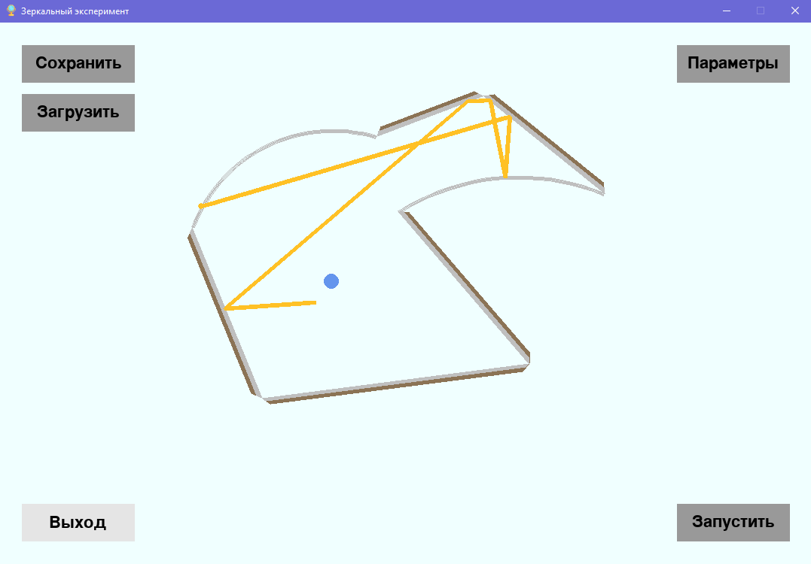

# Зеркальный эксперимент

### Автор: Рожков Игорь, 424, 2022



Зеркальный экспримент осуществляет возможности в моделировании оптических экспериментов с помощью зеркал. 
Проект практикума АЯ, 8 семестр.

## Требования к установке

```
Python 3.9+
easygui~=0.98.1
pygame~=2.1.2
```
## Запуск программы

Запуск программы осуществляется скриптом ```main.py```. 

# Эксперименты

Программа поддерживает несколько режимов. Для запуска эксперимента, загрузите эксперимент или создайте новый в настройках. Запуск осуществляется кнопкой "**Запустить**". 

# Настройки

Режим настроек позволяет создать собственную конфигурацию зеркал. Для этого нажмите на пустое пространство. После этого нарисуйте замкнутый многоугольник желаемого вида. Все зеркала по умолчанию будут созданы плоскими. Правой кнопкой мыши по зеркалу можно изменить его тип: плоское, вогнутое или выпуклое; левой - изменить параметры зеркала, такие как координаты его краёв или радиус кривизны (для сферических зеркал).

Добавьте источник света с помощью кнопки "**Добавить источник**". Источник света всегда закрепляется за первым зеркалом с настройками по умолчанию. Всё это можно изменить в окне "**Изменить источник**". 

Луч света (и его источник) характеризуется тремя параметрами: исходным *относительным положением* на зеркале, *углом* выхода и *скоростью*распространения. 

Добавьте цель назначения луча - круглую зону, в которую должен попасть свет. Попадание луча в эту зону считается успешным выполнением экспримента и всей программы. 

При желании можно очистить всё поле кнопкной "**Очистить поле**".

Только при наличии замкнутного многоугольника из зеркал, источника света и цели назначения луча света возможно запустить программу. Завершите настройку, нажав на кнопку "**Сохранить параметры**".

# Дополнительно

Все классы объявлены в соответствующих файлах в папке ```classes```.